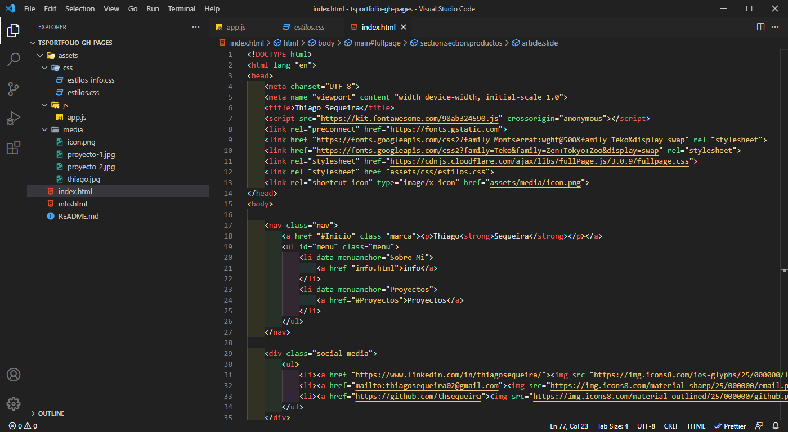

# Only Dark 🖤

<<<<<<< HEAD
A Visual Studio theme for lovers of dark mode and for those who work late. 👨‍💻👩‍💻

## ScreenShots 🌙

JavaScript
=======
Un tema de Visual Studio para los amantes del modo oscuro y de quedarse codeando hasta tarde. 👨‍💻👩‍💻

### ScreenShot 🌙

## Instación

1.Instala Visual Studio Code  
2.Ve al apartado de extenciones en el menú 
3.Busca a Only Dark 
4.Haz click en instalar 
5.En el menú click: Code > Preferencias > Color Theme > Only Dark 
6.Codea!

## Más información
* [Codigo Fuente de Only Dark](https://github.com/thsequeira/OnlyDark-VScodeTheme)
* [Thiago Sequeira](https://www.linkedin.com/in/thiagosequeira/)
>>>>>>> 25c447acc09a4cdf8cb194a1980a39d606ce5fa4

HTML

CSS

## Installation

1. Install Visual Studio Code  
2. Choose Extensions from menu 
3. Search for Only Dark 
4. Click Install to <strong>install it</strong> 
5. Click Reload to reload the Code
6. From the menu bar click: Code > Preferences > Color Theme > Only Dark 
7. Enjoy!

## More
* [Only Dark](https://github.com/thsequeira/OnlyDark-VScodeTheme)
* [Thiago Sequeira](https://www.linkedin.com/in/thiagosequeira/)

**Enjoy!**
