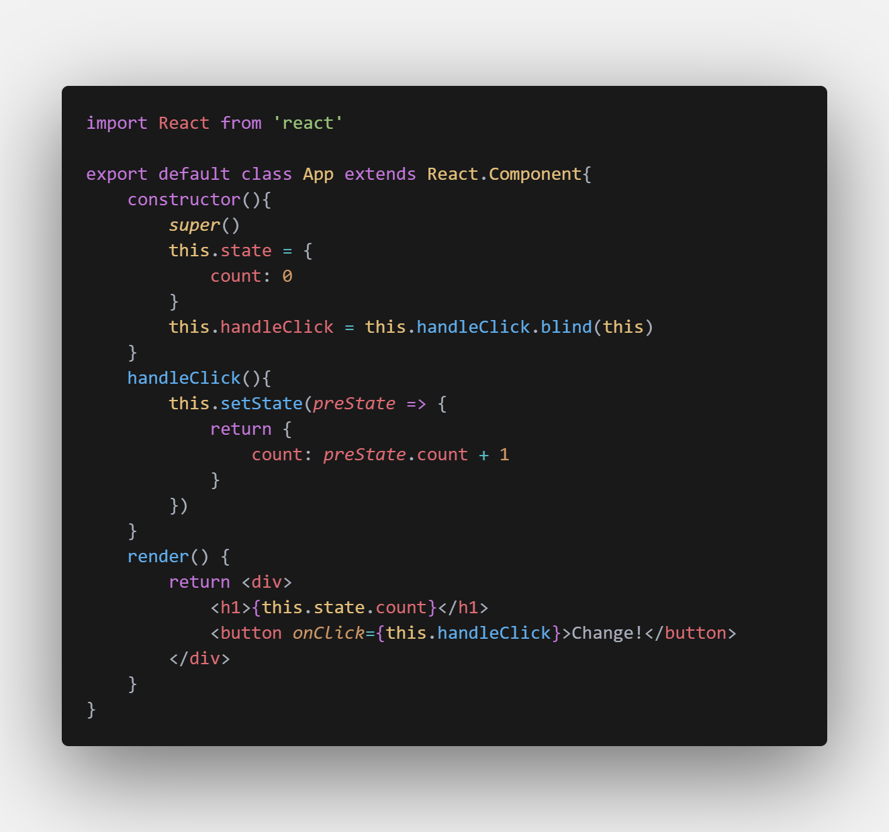

# Only Dark for Visual Studio Code

Only Dark is a color scheme, customized user interface theme for Visual Studio Code. It has been designed by the author of the original Only Dark colors. Carefully selected shades of colors are the foundation of an uncompromising, non-distractive user interface. The single goal of Only Dark is to let you focus on your code.

## ☞ How to install free for Visual Studio Code:

1. Install Visual Studio Code  
2. Choose Extensions from menu 
3. Search for Only Dark 
4. Click Install to <strong>install it</strong> 
5. Click Reload to reload the Code
6. From the menu bar click: Code > Preferences > Color Theme > Only Dark 
7. Enjoy!

## Credits

Special thank to [Thiago Sequeira](https://github.com/thsequeira), the creator of Only Dark original theme.
